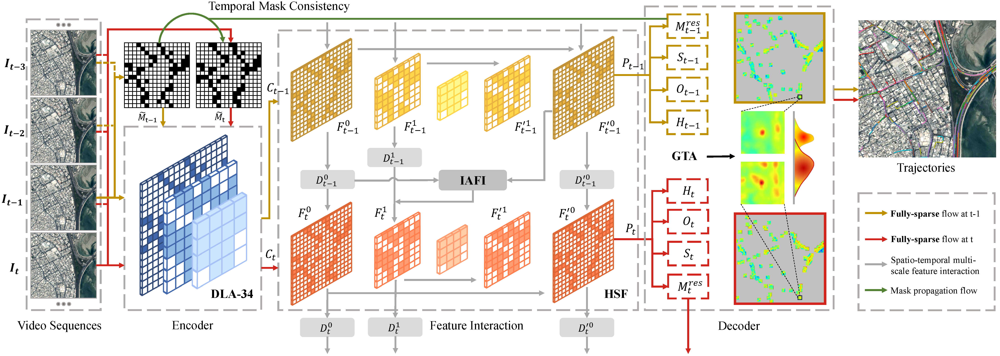

# SPAX

The official code of SPAX: Fully Sparse Framework with Hierarchical Spatio-temporal Fusion for Moving Object Tracking in Satellite Videos



## Abstract

Moving object tracking is a fundamental task in video satellite technologies. Existing methods typically introduce considerable unnecessary computational overhead of redundant background regions in spatial dimension and struggle to tackle the temporal challenges posed by the coupled motion of the satellite platform and ground objects. To address these issues, we propose a fully sparse framework with hierarchical spatio-temporal fusion (SPAX). Specifically, SPAX utilizes an object-centric fully-sparse paradigm to reduce computational redundancy by focusing only on foreground regions. Furthermore, we adopt the hierarchical spatio-temporal fusion (HSF) to address the complexity of dual-motion coupling through intra-frame multi-scale feature fusion, inter-frame symmetric feature interaction, and inter-frame asymmetric feature interaction, thereby enabling comprehensive temporal information utilization. Additionally, we propose a plug-and-play Gaussian-based trajectory association (GTA) strategy to mitigate the negative impact of observational drifts and accumulated errors. Experiments show that SPAX outperforms previous methods on two popular benchmarks, achieving notable improvements of $\mathbf{5.1}$ and $\mathbf{7.6}$ on MOTA. While achieving the state-of-the-art (SOTA) performance, SPAX-Base reduces GFLOPs by $\mathbf{88.4\%}$ and delivers a $\mathbf{2.7\times}$ speedup on SatVideoDT dataset, along with $\mathbf{93.2\%}$ GFLOPs reduction and up to a $\mathbf{3.1\times}$ acceleration on SatMTB-MOT dataset compared to our baseline. Furthermore, SPAX-Light outperforms the previous SOTA method by $\mathbf{6.6}$ MOTA and runs at $\mathbf{5.9\times}$ its inference speed on SatMTB-MOT dataset.

## Release

Trained models on ICPR and SatMTB datasets [[model weights](https://pan.baidu.com/s/1fDzTLXZZ7OMYjoYLuP676w?pwd=asd7)].

## Getting Started

### Environment

- Our experiments are conducted with *python3.8*, *pytorch1.11.0*, and *CUDA 11.3*.

```shell
pip install -r requirements.txt
```

- Install sparse computation dependency:
```shell
cd ./SparseCNN
python setup.py install
```

- Other dependency:
```shell
cd ./lib/external
python setup.py install
```


### Data Preparation

- The ICPR SatVideoDT dataset used here is available in https://satvideodt.github.io. (An extensive version of VISO dataset, with more data and corrected annotations)

- The SatMTB dataset is available in [BaiduYun](https://pan.baidu.com/s/1TBCnflx1M_Fk30xWcsDiqg?) with password **s5y7**, and the unzip password is **CSU@2023**.

- Processed data that can be used directly.
  1. ICPR: [BaiduYun](https://pan.baidu.com/s/1CE1UV-t7ltDhqeVuC6ZF4A) with password **c2qg**
  2. SatMTB: [BaiduYun](https://pan.baidu.com/s/1Jgfu82yQ0X6pNPHL4jZenw) with password **q51x**

```
-dataset
    |-ICPR
        |-train_data
            |-001
            |-002
            ...
        |-val_data
            |-001
            |-002
            ...
        |-annotations
            |-instances_train_caronly.json
            |-instances_val_caronly.json
	
    |-SatMTB
        |-train
            |-img
                |-airplane
                    |xx
                    ...
                |-car
                |-ship
                |-train
            |-label
                |-airplane
                    |xx.txt
                    ...
                |-car
                |-ship
                |-train
        |-test
            ...(same with train)
        |-img
            |-airplane
                |xx
                ...
            |-car
                |xx
                ...
            |-ship
                |xx
                ...
        |-instances_SatMTB_train.json
        |-instances_SatMTB_test_car.json
        |-instances_SatMTB_test_ship.json
        |-instances_SatMTB_test_airplane.json
```

### Training

#### Training for SatVideoDT.

```shell
CUDA_VISIBLE_DEVICES=<GPU_ID0, GPU_ID1 > python train.py --model_name DLAIterUpdate --gpus 0,1 --lr 1.25e-4 --lr_step 18 --num_epochs 20 --batch_size <batch size> --seqLen <sequence length> --datasetname ICPR --data_dir ./dataset/ICPR/
```

#### Training for SatMTB.

```shell
CUDA_VISIBLE_DEVICES=<GPU_ID0, GPU_ID1 > python train_satmtb.py --model_name DLAIterUpdate_for_satmtb --gpus 0,1 --lr 1e-4 --lr_step 28 --num_epochs 30 --batch_size <batch size> --seqLen <sequence length> --num_classes 3 --datasetname SatMTB --data_dir ./dataset/SatMTB/
```


### Testing

#### Testing for SatVideoDT (dense).

```shell
CUDA_VISIBLE_DEVICES=<GPU_ID> python testTracking.py --model_name DLAIterUpdate --gpus 0 --load_model <model weights> --datasetname ICPR --data_dir ./dataset/ICPR/ --seqLen <sequence length>
```

#### Testing for SatVideoDT (sparse).

```shell
CUDA_VISIBLE_DEVICES=<GPU_ID> python testTracking_sp.py --model_name DLAIterUpdate_sp --gpus 0 --load_model <model weights> --datasetname ICPR --data_dir ./dataset/ICPR/ --seqLen <sequence length>
```

#### Testing for SatMTB (dense).

```shell
CUDA_VISIBLE_DEVICES=<GPU_ID> python testTracking_satmtb.py --model_name DLAIterUpdate_for_satmtb --gpus 0 --load_model <model weights> --datasetname SatMTB --data_dir ./dataset/SatMTB/ --seqLen <sequence length> --num_classes 3
```

#### Testing for SatMTB (sparse).

```shell
CUDA_VISIBLE_DEVICES=<GPU_ID> python testTracking_satmtb_sp.py --model_name DLAIterUpdate_for_satmtb_sp --gpus 0 --load_model <model weights> --datasetname SatMTB --data_dir ./dataset/SatMTB/ --seqLen <sequence length> --num_classes 3
```

### Evaluation

#### Evaluation for SatVideoDT.

```shell
python eval.py
```

#### Evaluation for SatMTB.

```shell
python eval_satmtb.py
```


## Acknowledgement

Our idea is built upon the following projects. We really appreciate their excellent open-source works!

- [MP2Net (TGRS'24)](https://github.com/DonDominic/MP2Net#) [[related paper](https://ieeexplore.ieee.org/abstract/document/10493056)]
- [Hieum (TPAMI'24)](https://github.com/ChaoXiao12/Moving-object-detection-in-satellite-videos-HiEUM) [[related paper](https://arxiv.org/html/2411.15895v1)]
- [DeltaCNN (CVPR'22)](https://github.com/facebookresearch/DeltaCNN) [[related paper](https://openaccess.thecvf.com/content/CVPR2022/papers/Parger_DeltaCNN_End-to-End_CNN_Inference_of_Sparse_Frame_Differences_in_Videos_CVPR_2022_paper.pdf)]
- [CenterNet (ICCV'19)](https://github.com/xingyizhou/CenterNet) [[related paper](https://arxiv.org/abs/1904.07850)]